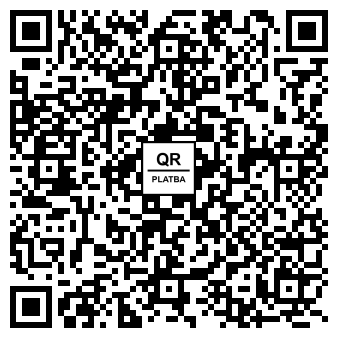

# QR Platba

[](https://packagist.org/packages/miskith/qr-platba)
[](https://packagist.org/packages/miskith/qr-platba)
[](https://packagist.org/packages/miskith/qr-platba)
[](https://github.com/miskith/QRPlatba/actions/workflows/ci.yml)

Knihovna pro snadné a spolehlivé generování platebních QR kódů (**QR Platba** dle standardu České bankovní asociace SPAYD) a fakturačních QR kódů (**QR Faktura** dle specifikace Komory daňových poradců ČR) v PHP.

QR platba zjednodušuje koncovému uživateli provedení příkazu k úhradě v mobilním bankovnictví, protože obsahuje veškeré platební údaje, které stačí pouze naskenovat.

### Vlastnosti knihovny:

- Generování standardního řetězce **SPAYD 1.0** i integrované či samostatné **QR Faktury** (**SID 1.0**).
- Plná typovost s podporou **PHP 8.4 Enumů** (`Format`, `Currency`, `PaymentType`, `InvoiceDocumentType`, `TaxPerformance`).
- Možnost validace českých čísel účtů dle vyhlášky ČNB (formát a vážené **Modulo 11**) pomocí `setValidateAccount(true)` nebo staticky `QRInvoice::validateCzechAccount($acc)`.
- Podpora pro **okamžité platby** (`PT:IP`).
- Podpora pro **alternativní účty příjemce** (`ALT-ACC`).
- Podpora pro **notifikace o platbě** na e-mail (`NT:E`) i SMS (`NT:P`).
- Doplňující parametry pro systémy výstavce: interní ID dokladu (`X-ID`), URL adresa (`X-URL`), perioda opakování (`X-PER`).
- Podpora pro výpočet kontrolního součtu **CRC32** z kanonického řetězce dle specifikace ČBA a KDP ČR (`$qrInvoice->setCRC32(true)`).
- Zobrazení HTML `` tagu obsahujícího rovnou `data-uri` s QR kódem bez nutnosti ukládat soubor na disk (`$qrInvoice->getQRCodeImage()`).
- Získání čistého `data-uri` řetězce (`$qrInvoice->getQRCodeImage(false)`).
- Uložení do souboru v široké škále formátů: **PNG, SVG, PDF, EPS, WebP, GIF, binární** (`$qrInvoice->saveQRCodeImage()`).
- Získání instance objektu [Endroid\QrCode\QrCode](https://github.com/endroid/qr-code) pro pokročilé úpravy (`$qrInvoice->getQRCodeInstance()`).
- Vložení loga do středu QR kódu: oficiální logo ČBA „QR Platba“ (`withDefaultLogo`) i libovolné vlastní firemní logo (`setLogo`).
- Přizpůsobení barev na míru firemnímu brandingu: barva popředí (`setForegroundColor`), pozadí (`setBackgroundColor`), hromadně (`setColors`) i průhledné pozadí (`setTransparentBackground`).
- Podpora pro české i slovenské bankovní účty (automatický převod na IBAN: `setAccount`, `setSlovakAccount`) i přímé zadání IBAN/BIC.
- Podpora pro standard **SEPA EPC QR Code** (EPC069-12) pro platby v rámci celé **Eurozóny** (`Standard::Epc`).
- Podpora pro měnu CZK i ostatní světové měny dle ISO 4217 pomocí `setCurrency(Currency::CZK)`.

> [!TIP]
> **Doporučení pro typovost (PHP 8.4 Enums):**  
> V PHP 8.4 důrazně doporučujeme používat nativní Enumy (`Format`, `Currency`, `PaymentType`, `InvoiceDocumentType`, `TaxPerformance`).  
> Předávání skalárních řetězců a celých čísel (např. `'png'`, `'CZK'`, `0`) je z důvodu zachování zpětné kompatibility stále podporováno, ale je označeno jako **deprecated** a v budoucí verzi knihovny bude odstraněno.

QR Platbu dnes podporují prakticky všechny tuzemské banky (např. Air Bank, Česká spořitelna, ČSOB, Fio banka, Komerční banka, mBank, MONETA Money Bank, Raiffeisenbank, UniCredit Bank, Banka Creditas a další).

### Požadavky:
- PHP ^8.4
- Rozšíření `ext-mbstring` a `ext-gd`

## Instalace pomocí Composeru

```bash
composer require miskith/qr-platba
```

---

## Příklad QR platby

```php
<?php

require __DIR__ . '/vendor/autoload.php';

use miskith\QRInvoice\Enum\Currency;
use miskith\QRInvoice\QRInvoice;

$qrInvoice = new QRInvoice()
    ->setAccount('27-16060243/0300')
    ->setAmount(1234.50)
    ->setVariableSymbol('2016001234')
    ->setConstantSymbol('0308')
    ->setSpecificSymbol('1234')
    ->setMessage('Toto je první QR platba.')
    ->setCurrency(Currency::CZK) // Doporučeno použít Enum Currency::CZK
    ->setDueDate(new \DateTime('+14 days'))
    ->setCRC32(true);           // Volitelný kontrolní součet CRC32 dle ČBA

echo $qrInvoice->getQRCodeImage(); // Zobrazí  tag s QR kódem
```


Lze použít i zkrácený zápis pomocí statického konstruktoru:

```php
echo QRInvoice::create('27-16060243/0300', 987.60, '2016001234')
    ->setMessage('QR platba je parádní!')
    ->getQRCodeImage();
```

---

## Rozšířené možnosti QR platby (standard ČBA SPAYD)

Knihovna plně podporuje veškeré volitelné atributy standardu ČBA s využitím Enumů:

```php
use miskith\QRInvoice\Enum\Currency;
use miskith\QRInvoice\Enum\PaymentType;
use miskith\QRInvoice\QRInvoice;

$qrInvoice = new QRInvoice()
    ->setAccount('27-16060243/0300')
    ->setAmount(500.00)
    ->setCurrency(Currency::CZK)
    ->setVariableSymbol('2026001')
    ->setMessage('Platba objednávky')
    // Požadavek na okamžitou platbu (převod během několika sekund)
    ->setInstantPayment(true) // nebo ->setPaymentType(PaymentType::Instant)
    // Alternativní účty (např. pro bezplatný převod v rámci stejné banky)
    ->setAlternativeAccounts(['2501301193/2010', 'CZ5855000000001265098001+RZBCCZPP'])
    // Notifikace výstavci o odeslání platby na e-mail nebo SMS
    ->setNotificationEmail('faktury@firma.cz')
    // ->setNotificationPhone('+420777123456')
    // Interní identifikátor objednávky/faktury v systému výstavce
    ->setInternalId('OBJ-2026-001')
    // Odkaz na detail platby nebo webový portál
    ->setUrl('https://mojefirma.cz/platba/123')
    // Perioda opakované platby ve dnech (1 - 30)
    ->setRepeat(7)
    // Automatický kontrolní součet integrity
    ->setCRC32(true);
```

---

## Validace čísla účtu (Modulo 11 ČNB)

Knihovna obsahuje validátor formátu a váženého kontrolního součtu modulo 11 pro česká čísla bankovních účtů dle vyhlášky ČNB č. 169/2011 Sb.:

```php
use miskith\QRInvoice\QRInvoice;

// Zapnutí validace čísla účtu při přiřazení:
$qr = new QRInvoice();
$qr->setValidateAccount(true)
   ->setAccount('27-16060243/0300'); // Pokud účet neprojde kontrolou Modulo 11, vyhodí QRInvoiceException

// Samostatné ověření čísla účtu kdekoli v aplikaci:
$isValid = QRInvoice::validateCzechAccount('27-16060243/0300'); // true / false
```

---

## Slovenské bankovní účty (SK)

Knihovna plně podporuje převod slovenských čísel účtů na IBAN (`SK...`) i jejich validaci podle pravidel Národnej banky Slovenska (NBS):

```php
use miskith\QRInvoice\QRInvoice;

$qr = new QRInvoice();

// Automatický převod slovenského účtu na SK IBAN:
$qr->setSlovakAccount('1234567890/0200'); // vygeneruje SK6702000000001234567890

// Volitelná validace Modulo 11 pro slovenské účty:
$qr->setValidateAccount(true)
   ->setSlovakAccount('1234567890/0200');

// Samostatné ověření slovenského účtu:
$isValid = QRInvoice::validateSlovakAccount('1234567890/0200');
```

---

## Platby v Eurozóně (SEPA EPC QR Code)

Pro platby v eurech v rámci celé Evropské unie / Eurozóny (Slovensko, Německo, Rakousko atd.) knihovna podporuje oficiální evropský standard **EPC Quick Response Code** (EPC069-12 pro SEPA Credit Transfer):

```php
use miskith\QRInvoice\Enum\Currency;
use miskith\QRInvoice\Enum\Standard;
use miskith\QRInvoice\QRInvoice;

$qr = new QRInvoice();
$qr->setStandard(Standard::Epc)
   ->setRecipientName('Firma s.r.o.')
   ->setIban('SK6702000000001234567890')
   ->setBic('SUBAASKBX')                   // Volitelný BIC / SWIFT
   ->setAmount(150.00)
   ->setCurrency(Currency::EUR)
   ->setVariableSymbol('2026001')
   ->setMessage('Platba objednavky');

// Vrátí EPC řetězec nebo rovnou HTML  tag s QR kódem:
echo $qr->getQRCodeImage();
```

---

## Vložení loga do QR kódu

Knihovna umožňuje do středu QR kódu vložit buď oficiální doporučené logo ČBA **„QR Platba“**, nebo libovolné **vlastní firemní logo**. Při použití loga knihovna automaticky nastaví úroveň korekce chyb na `High` (30 % redundance), aby byl kód vždy bez problémů naskenovatelný.

### 1. Oficiální logo ČBA („QR Platba“)

Pro vložení oficiálního loga ČBA stačí zavolat metodu `withDefaultLogo()`:

```php
$qr = new QRInvoice()
    ->setAccount('27-16060243/0300')
    ->setAmount(500.00)
    ->setMessage('Platba s logem ČBA')
    ->withDefaultLogo(55); // Nastaví oficiální logo ČBA o velikosti 55x55 px

echo $qr->getQRCodeImage();
```



### 2. Vlastní firemní logo

Do středu kódu můžete umístit jakýkoli vlastní PNG obrázek či logo vaší společnosti:

```php
$qr = new QRInvoice()
    ->setAccount('27-16060243/0300')
    ->setAmount(1250.00)
    ->setMessage('Platba s vlastním logem')
    ->setLogo(__DIR__ . '/cesta/k/firemni-logo.png', width: 55, height: 55);

echo $qr->getQRCodeImage();
```


---

## Přizpůsobení barev (firemní branding)

Knihovna umožňuje libovolně přizpůsobit barvu modulů (popředí) i barvu pozadí tak, aby QR kód ladil s vizuální identitou vaší značky nebo designem faktury:

Barvy lze zadávat několika způsoby:
- **HEX kód** (např. `'#0F172A'`, `'#4F46E5'`, `'#FFF'`)
- **RGB složky** (např. `$qr->setForegroundColor(15, 23, 42)`)
- **Objekt `Endroid\QrCode\Color\Color`**
- **Průhledné pozadí** pomocí `setTransparentBackground(true)`

```php
$qr = new QRInvoice()
    ->setAccount('27-16060243/0300')
    ->setAmount(1890.00)
    ->setVariableSymbol('2026099')
    ->setMessage('Objednavka #2026099')
    ->setForegroundColor('#0F172A') // Tmavé slate popředí
    ->setBackgroundColor('#F8FAFC') // Jemně šedé pozadí
    ->setLogo(__DIR__ . '/cesta/k/logo.png', 55, 55);

echo $qr->getQRCodeImage();
```


> [!TIP]
> **Doporučení pro kontrast:** Pro zachování spolehlivé čitelnosti všemi mobilními fotoaparáty a bankovními aplikacemi vždy dbejte na dostatečný kontrast mezi popředím a pozadím (ideálně tmavé popředí na světlém podkladu).

---

## Příklad QR faktury a platby v jednom (QR Platba+F)

Při vyplnění údajů faktury (`setInvoiceId`, `setInvoiceDate` apod.) je vytvořena platba se začleněnou QR Fakturou v atributu `X-INV`:

```php
<?php

require __DIR__ . '/vendor/autoload.php';

use miskith\QRInvoice\Enum\InvoiceDocumentType;
use miskith\QRInvoice\Enum\TaxPerformance;
use miskith\QRInvoice\QRInvoice;

$qrInvoice = QRInvoice::create('27-16060243/0300', 495.00, '012150672')
    ->setInvoiceId('012150672')
    ->setInvoiceDocumentType(InvoiceDocumentType::TaxInvoice)
    ->setDueDate(new \DateTime('2026-12-17'))
    ->setInvoiceDate(new \DateTime('2026-12-01'))
    ->setTaxDate(new \DateTime('2026-12-01'))
    ->setTaxPerformance(TaxPerformance::Standard)
    ->setCompanyTaxId('CZ60194383')
    ->setCompanyRegistrationId('60194383')
    ->setInvoiceSubjectTaxId('CZ12345678')
    ->setTaxBase(409.09, 0)
    ->setTaxAmount(85.91, 0);

echo $qrInvoice->getQRCodeImage();
```


---

## Příklad QR faktury (pouze faktura bez platby)

Pokud chcete vygenerovat pouze účetní údaje faktury bez platebního příkazu:

```php
<?php

require __DIR__ . '/vendor/autoload.php';

use miskith\QRInvoice\Enum\InvoiceDocumentType;
use miskith\QRInvoice\Enum\TaxPerformance;
use miskith\QRInvoice\QRInvoice;

$qrInvoice = new QRInvoice()
    ->setIsOnlyInvoice(true)
    ->setIban('CZ9701000000007098760287+KOMBCZPP')
    ->setAmount(61189.00)
    ->setVariableSymbol('3310001054')
    ->setInvoiceId('2001401154')
    ->setInvoiceDocumentType(InvoiceDocumentType::Other) // Enum nebo int 9
    ->setDueDate(new \DateTime('2026-04-12'))
    ->setInvoiceDate(new \DateTime('2026-04-04'))
    ->setTaxDate(new \DateTime('2026-04-04'))
    ->setTaxPerformance(TaxPerformance::Standard)       // Enum nebo int 0
    ->setCompanyTaxId('CZ25568736')
    ->setCompanyRegistrationId('25568736')
    ->setInvoiceSubjectTaxId('CZ25568736')
    ->setInvoiceSubjectRegistrationId('25568736')
    ->setMessage('Dodávka vybavení interiéru')
    ->setTaxBase(26492.70, 0)
    ->setTaxAmount(5563.47, 0)
    ->setTaxBase(25333.10, 1)
    ->setTaxAmount(3799.97, 1)
    ->setNoTaxAmount(-0.24)
    ->setInvoiceIncludingDeposit(false);

echo $qrInvoice->getQRCodeImage();
```


---

## Export a formáty

### Uložení do souboru

Pro volbu výstupního formátu doporučujeme používat Enum `Format`:

```php
use miskith\QRInvoice\Enum\Format;

// PNG o velikosti 300x300 px (výchozí)
$qrInvoice->saveQRCodeImage('qrcode.png', Format::Png, 300);

// SVG o velikosti 200x200 px s 5 px marginem
$qrInvoice->saveQRCodeImage('qrcode.svg', Format::Svg, 200, 5);

// WebP obrázek
$qrInvoice->saveQRCodeImage('qrcode.webp', Format::Webp, 300);

// GIF obrázek
$qrInvoice->saveQRCodeImage('qrcode.gif', Format::Gif, 150);

// PDF dokument
$qrInvoice->saveQRCodeImage('qrcode.pdf', Format::Pdf, 300);

// EPS vektorový soubor
$qrInvoice->saveQRCodeImage('qrcode.eps', Format::Eps, 300);

// Binární výstup
$qrInvoice->saveQRCodeImage('qrcode.bin', Format::Binary, 300);
```

#### Přehled hodnot Enumu `Format`:
* `Format::Png`
* `Format::Svg`
* `Format::Webp`
* `Format::Gif`
* `Format::Pdf`
* `Format::Eps`
* `Format::Binary` (nebo alias `Format::Bin`)

### Zobrazení Data URI

```php
// Vrátí řetězec ve formátu: data:image/png;base64,iVBORw0KGgoAAAANSUhEUgAA...
$dataUri = $qrInvoice->getQRCodeImage(false);
```

### Získání textového SPAYD / SID řetězce

```php
$spaydString = (string) $qrInvoice;
// např. "SPD*1.0*ACC:CZ3103000000270016060243*AM:1234.50*CC:CZK*X-VS:2016001234"
```

---

## Kontrolní součet CRC32

Specifikace ČBA SPAYD a KDP ČR umožňují přidat kontrolní součet `CRC32` pro ověření integrity dat:

```php
// Aktivace automatického výpočtu CRC32
$qrInvoice->setCRC32(true);

// Získání vypočteného 8místného hexadecimálního kontrolního součtu (např. "AAD80227")
$crc = $qrInvoice->getCRC32();
```

Kontrolní součet je počítán algoritmem IEEE 802.3 přes kanonickou podobu řetězce (s abecedně setříděnými atributy) přesně podle oficiální specifikace.

---

## Odkazy

- [Oficiální specifikace formátu QR Platba (ČBA)](https://qr-platba.cz/pro-vyvojare/specifikace-formatu/)
- [Oficiální web QR Faktury](https://qr-faktura.cz/)
- [Originální projekt na GitHubu](https://github.com/dfridrich/QRPlatba)
- [Balíček na Packagist.org](https://packagist.org/packages/miskith/qr-platba)

## Licence

Tento projekt je licencován pod licencí MIT - podrobnosti naleznete v přiloženém souboru [LICENSE](LICENSE).
